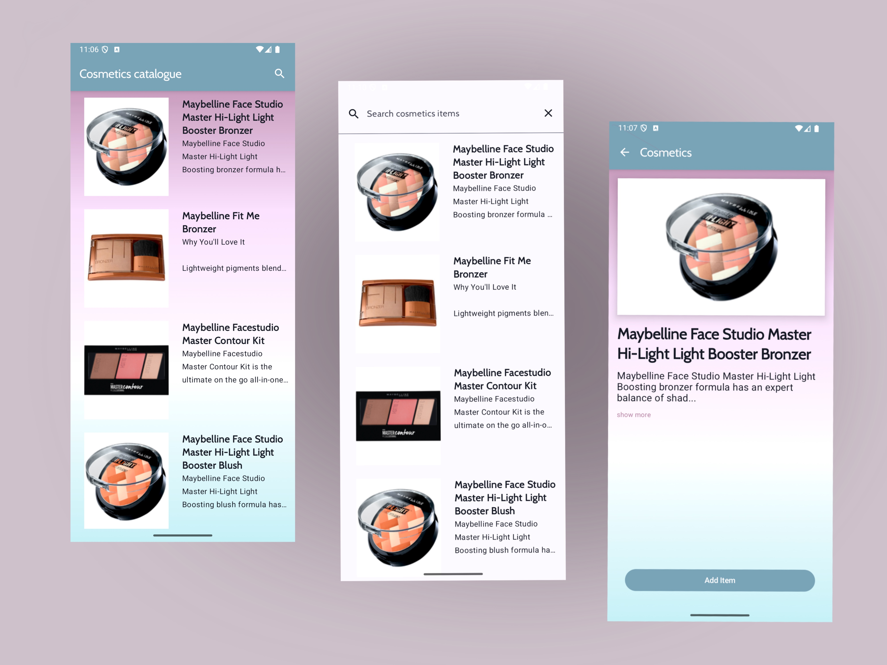

# 🧴K - Beauty Lab App

**K-beauty Lab** is a sample Android app built with **Jetpack Compose**, showcasing a cosmetic catalogue. It allows users to:

🛍️ Browse a collection of cosmetic products

🔍 Perform searches to find specific items

📋 View detailed information on each product

This project demonstrates modern Android development practices using Kotlin and Jetpack Compose.

## 📸 Screenshots

## 🛠️ Tech Stack
- Jetpack Compose
- Kotlin
- Coroutines
- Retrofit
- Coil

## 🌐 API Source
The app fetches cosmetic product data from the [Makeup API](http://makeup-api.herokuapp.com), an open REST API providing information on various beauty products.
